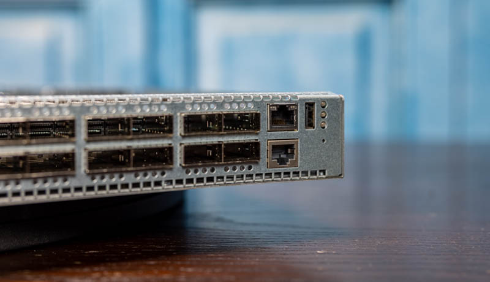
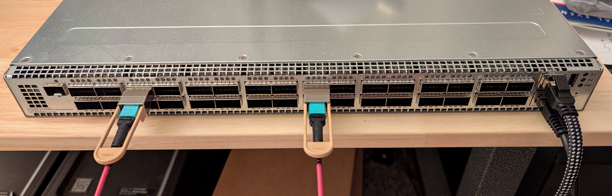

# DX010: Physical Setup and Initial Access

This guide covers the physical cabling and initial software access for the Celestica Seastone DX010.

## Prerequisites

### Equipment Needed

| Item                                           | Purpose                    |
| ---------------------------------------------- | -------------------------- |
| DX010 switch                                   | The switch itself |
| 2x AC power cables (C13-to-C14 or C13-to-wall) | Power to the two PSUs |
| Serial console cable                           | Serial access to the management CPU |
| RJ45 Ethernet cable                            | Out-of-band management network connection |
| QSFP28 DAC cables or optical transceivers      | Data-plane connections to servers or other switches |
| Laptop or workstation with a terminal emulator | Serial console and SSH access |
| Rack or stable surface                         | Physical mounting |

The DX010 ships with an RJ45-to-DB9 serial console cable. Most modern laptops lack a DB9 serial port, so you will likely need a **USB-to-DB9** adapter to connect the included cable to your workstation.

### Terminal Emulator Software

This guide uses `picocom` for serial console access. Install it if needed:

```bash
sudo apt install picocom
```

On macOS, `picocom` is available via Homebrew (`brew install picocom`). On Windows, use PuTTY or Tera Term in serial mode.


## Step 1: Rack and Power

### Mount the Switch

The DX010 is a 1U rack-mount chassis. If using a rack, install the rails and slide the switch into position. If using a bench, place the switch on a flat, stable surface with at least 15 cm of clearance at both the front (air intake) and rear (exhaust) to allow proper airflow.

### Connect Power Cables

The DX010 has two 800W Delta power supply units on opposite ends of the rear panel. Each PSU has a standard IEC C14 inlet.

1. Connect a power cable to **PSU 1** (left side of rear panel).
2. Connect a power cable to **PSU 2** (right side of rear panel).

Using both PSUs provides 1+1 redundancy: either PSU can power the entire switch alone. For lab use, a single PSU is sufficient, but both are recommended for reliability.

Under normal operation with DAC cables or low-power optics, the switch draws approximately **150–200W total**. The 800W PSU rating covers worst-case scenarios with all 32 ports populated with high-power long-reach optics.

### Verify Fans

Before powering on, confirm all five fan modules are seated in the rear panel. Push each module firmly into its slot until the latch engages. Missing or unseated fan modules will cause thermal alarms and potentially automatic shutdown.

### Power On

There is no discrete power button on the DX010. The switch powers on automatically when AC power is applied to at least one PSU. You will hear the fans spin up immediately. During early boot, the CPLD runs a lamp test: all front-panel port LEDs briefly light green to verify they are functional, then turn off.

Once SONiC finishes booting and the `ledd` daemon takes over, the LEDs reflect actual link status (green = link up, off = no link).


## Step 2: Serial Console Connection

The serial console is the **first and most reliable** way to access the switch. It works regardless of network configuration, IP addressing, or whether SONiC has booted correctly. You must establish serial access before doing anything else.

### Identify the Serial Console Port

On the right side of the front panel, next to the 32 QSFP28 data ports, there are two RJ45 jacks stacked vertically. The **upper** RJ45 is the management Ethernet port. The **lower** RJ45 is the serial console port. Do not confuse the two.



### Connect the Cable

1. Plug the RJ45 end of the console cable into the serial console port on the switch.
2. Plug the other end (USB or DB9) into your workstation.
3. Identify the serial device on your workstation:
   - **Linux:** `ls /dev/ttyUSB*` (typically `/dev/ttyUSB0`)
   - **macOS:** `ls /dev/tty.usbserial-*`
   - **Windows:** Check Device Manager → Ports (COM & LPT) for the COM port number

### Configure Terminal Settings

Use the following serial parameters:

| Parameter    | Value  |
| ------------ | ------ |
| Baud rate    | 9600   |
| Data bits    | 8      |
| Stop bits    | 1      |
| Parity       | None   |
| Flow control | None   |

Connect using `picocom`:

```bash
sudo picocom -b 9600 /dev/ttyS0
```

> Use `/dev/ttyS0` for a native DB9 serial port, or `/dev/ttyUSB0` if using a USB-to-serial adapter. Run `sudo dmesg | grep tty` to identify your device.

> **Baud rate note:** On the DX010, the serial console operates at **9600** baud across all tested SONiC versions. The Celestica user manual references 115200, but the actual BIOS/GRUB configuration on this platform uses 9600. If picocom connects but you see garbled output, try `-b 115200` as a fallback. You can verify the active baud rate over SSH with `sudo cat /proc/cmdline` and checking the `console=ttyS0,<baud>` parameter.

> To exit picocom, press **Ctrl+A** then **Ctrl+X**.

### Observe Boot Output

The DX010 is frequently sold — especially on the secondary market — with a SONiC image already installed. If that is the case, the switch will boot directly into SONiC without requiring an ONIE install step.

Once the serial connection is established and the switch is powered, you will see boot output on the terminal:

1. **ONIE GRUB menu** — appears first, listing the installed SONiC image (if present), ONIE Install OS, ONIE Rescue, etc.
2. **Linux kernel boot messages** — after the SONiC image is selected (automatically after a timeout or manually).
3. **SONiC login prompt** — appears when the system has fully booted.

If the switch was already powered on before you connected the serial cable, press **Enter** to get a login prompt.

### Log In

Default SONiC credentials (from the [SONiC documentation](https://github.com/sonic-net/SONiC/blob/master/doc/user-manual/SONiC-User-Manual.md)):

| Field | Value |
| ----- | ----- |
| Username | `admin` |
| Password | `YourPaSsWoRd` |

After logging in, change the default password immediately:

```
passwd
```


## Step 3: Initial Health Checks

These checks should be performed before connecting any data cables.

### Check the Intel Atom C2000 Stepping (AVR54 Bug)

Early steppings of the Intel Atom C2000 have a silicon defect (AVR54) that causes the CPU to fail permanently after extended use.

```
sudo setpci -s 00:00.0 8.w
```

- **`0003`** — C0 stepping. Bug is fixed. Safe to use.
- **Any other value** — affected stepping. The switch may fail to boot after a future power cycle.

### Check SONiC Version

```
show version
```

Note the `SONiC Software Version` and `HwSKU` fields. The HwSKU should show `Seastone-DX010`. If the version is old, [plan an upgrade](#step-5-sonic-image-upgrade).

### Check Platform Health

```
show platform summary
show platform psustatus
show platform fan
show platform temperature
```

Verify that both PSUs show "OK", all five fans are detected and running, and temperatures are within normal range.


## Step 4: Management Ethernet Connection

The management Ethernet port provides out-of-band network access to the switch (SSH, SCP, HTTP). It connects to the management CPU, not to the switching ASIC — it is completely independent of the 32 QSFP28 data ports.

### Connect the Cable

Plug a standard RJ45 Ethernet cable into the **management Ethernet port** on the front panel (labeled "MGT" or "Management", next to the serial console port). Connect the other end to your management network (a switch, router, or directly to your workstation).

### Check for DHCP Address

By default, SONiC configures the management interface (`eth0`) as a DHCP client. If your network has a DHCP server, the switch may already have an IP address:

```
/sbin/ifconfig eth0
```

If an IP address is shown, you can SSH to the switch from your management network:

```bash
ssh admin@<ip-address>
```

### Configure a Static IP (If No DHCP)

If there is no DHCP server on your management network, assign a static IP via the serial console:

```
sudo config interface ip add eth0 <ip-address>/<prefix-length> <gateway>
```

Example:

```
sudo config interface ip add eth0 192.168.1.100/24 192.168.1.1
```

Save the configuration so it persists across reboots:

```
sudo config save -y
```

Verify:

```
/sbin/ifconfig eth0
```

You should now be able to SSH to the switch from your management network.


## Step 5: SONiC Image Upgrade

The DX010 uses the **Broadcom** platform image (`sonic-broadcom.bin`). If the switch is running an outdated SONiC release, upgrade to a tested branch from the table below.

> **SONiC support lifecycle:** Tomahawk 1 was the pioneering ASIC for SONiC, and Broadcom's community SAI still supports it. However, upstream development increasingly targets Tomahawk 3, 4, and 5 — newer features (advanced telemetry, SRv6, certain hardware offloads) may not be backported to the BCM56960 SAI layer. Pin to a well-tested release branch rather than tracking `master`, where regressions on first-generation hardware are more likely to go unnoticed.

### Tested Branches

| Branch | Kernel | Debian | DX010 Status |
|--------|--------|--------|--------------|
| 202311 | 5.10   | 11 (Bullseye) | Tested and working |
| 202405 | 6.1    | 12 (Bookworm) | Tested and working |
| 202411 | 6.1    | 12 (Bookworm) | Expected to work (same kernel series as 202405); not yet tested |
| 202505 | 6.12   | 13 (Trixie)   | Crashes — `dx010_cpld` driver incompatible with kernel 6.12 Fortify checks |
| 202511 | 6.12   | 13 (Trixie)   | Crashes — same CPLD driver issue |

### Find the Image

The DX010 platform identifier is `x86_64-cel_seastone-r0`. Download the Broadcom image for your target release from the [SONiC build page](https://sonic-build.azurewebsites.net/ui/sonic/Pipelines) or from Celestica support.

### Transfer and Install

**Option A — Download directly on the switch:**

```bash
curl -L -o /home/admin/sonic-broadcom.bin "https://sonic-build.azurewebsites.net/api/sonic/artifacts?branchName=xxx"
```

**Option B — Transfer from your workstation:**

```bash
scp sonic-broadcom.bin admin@<switch-ip>:/home/admin/
```

Then install on the switch:

```
sudo sonic-installer install /home/admin/sonic-broadcom.bin
```

### Reboot

```
sudo reboot
```

The SSH session will disconnect immediately. The serial console remains active through the reboot, allowing you to watch the full boot sequence and catch any errors.

After reboot, verify the new version:

```
show version
```


## Step 6: Data Cable Connections

### SONiC Interface Naming

Before connecting cables, it helps to understand how SONiC names the 32 data ports. Run `show interfaces status` to see the mapping:

```text
admin@sonic:~$ show interfaces status
  Interface            Lanes    Speed    MTU    FEC    Alias    Vlan    Oper    Admin    Type    Asym PFC
-----------  ---------------  -------  -----  -----  -------  ------  ------  -------  ------  ----------
  Ethernet0      65,66,67,68     100G   9100     rs     Eth1  routed    down       up     N/A         off
  Ethernet4      69,70,71,72     100G   9100     rs     Eth2  routed    down       up     N/A         off
  Ethernet8      73,74,75,76     100G   9100     rs     Eth3  routed    down       up     N/A         off
 Ethernet12      77,78,79,80     100G   9100     rs     Eth4  routed    down       up     N/A         off
 Ethernet16      33,34,35,36     100G   9100     rs     Eth5  routed    down       up     N/A         off
...
Ethernet108      29,30,31,32     100G   9100     rs    Eth28  routed    down       up     N/A         off
Ethernet112  113,114,115,116     100G   9100     rs    Eth29  routed    down       up     N/A         off
Ethernet116  117,118,119,120     100G   9100     rs    Eth30  routed    down       up     N/A         off
Ethernet120  121,122,123,124     100G   9100     rs    Eth31  routed    down       up     N/A         off
Ethernet124  125,126,127,128     100G   9100     rs    Eth32  routed    down       up     N/A         off
```

| Column      | Meaning                                                                                                         |
| ----------- | --------------------------------------------------------------------------------------------------------------- |
| Interface   | SONiC's internal name. `Ethernet<N>` where N increments by 4 (the lane count per port macro). Ethernet0 is the first port, Ethernet4 the second, etc. |
| Lanes       | SerDes lane IDs (1–128) assigned to this port. Each 100G port uses exactly 4 lanes (one 4-lane port macro). |
| Speed       | Aggregate link speed — 100G when all 4 lanes are bonded at 25G each. |
| MTU         | Maximum transmission unit in bytes. 9100 is the SONiC default (jumbo frames). |
| FEC         | Forward Error Correction mode. `rs` = Reed-Solomon (CL91), the 100G default. Other values: `fc` (Firecode/CL74, common for 25G), `none`. |
| Alias       | Front-panel label (Eth1–Eth32), matching the chassis silkscreen. |
| Vlan        | `routed` (L3) or a VLAN ID (L2). Default is routed. |
| Oper/Admin  | Operational state (link detected or not) vs. administrative state (enabled or shut down by config). |
| Type        | Transceiver type detected in the cage (N/A = no module inserted). |
| Asym PFC    | Asymmetric Priority Flow Control — off by default; relevant for lossless RDMA. |

**Why lane numbers are not sequential across ports:** Ethernet0 uses lanes 65–68, but Ethernet16 jumps to 33–36. Lane numbering reflects the physical wiring between the ASIC die and the QSFP28 cages, determined by the board layout — not front-panel order. The `hwsku` port configuration file (`port_config.ini` or `platform.json`) defines this mapping.

**The Ethernet\<N\> naming rule:** N = port index × lanes per port macro. With 4 lanes per macro: index 0 → Ethernet0, index 1 → Ethernet4, … index 31 → Ethernet124. This convention reserves gaps for breakout sub-ports (e.g., Ethernet0 broken into 4x25G becomes Ethernet0–Ethernet3).


### Choose Your Cable Type

For a lab environment with servers in the same rack, **QSFP28 DAC cables** are the simplest and most cost-effective option. Other cable types are available for longer reaches:

| Cable Type                           | Use Case             | Notes |
| ------------------------------------ | -------------------- | ----- |
| QSFP28 DAC (Direct Attach Copper)    | Same rack, 1–5 m     | Passive, no optics, lowest cost and power |
| QSFP28 AOC (Active Optical Cable)    | Medium reach, 5–30 m | Active optical, fixed cable+optics |
| QSFP28 SR4 transceiver + MMF         | Up to 100 m          | Separate transceiver + MPO fiber patch cord |
| QSFP28 LR4 / CWDM4 transceiver + SMF | 2–10 km              | Separate transceiver + LC fiber patch cord |


### Insert Cables or Transceivers

- **For DAC/AOC cables:** Insert one end into a QSFP28 port on the DX010 and the other end into the server NIC (e.g., Mellanox ConnectX-4/5/6). The cable clicks into the cage when fully seated. To remove, pull the tab or latch on the cable connector.

- **For optical transceivers:** Insert the QSFP28 transceiver module into the cage first (it clicks when seated), then connect the fiber patch cord to the transceiver's LC or MPO connector.


### Example: 100G-SR4 Optical Link

The following example uses two 100GBASE-SR4 transceivers and an MPO multimode fiber patch cord to connect two ports on the same DX010 — a loopback configuration useful for testing and validation.



**Transceiver**

| Attribute       | Value |
| --------------- | ----- |
| Vendor          | 10Gtek |
| Standard        | 100GBASE-SR4 (IEEE 802.3bm) |
| Form Factor     | QSFP28 |
| Wavelength      | 850 nm (VCSEL) |
| Fiber Type      | OM3 multimode (up to 70 m) / OM4 multimode (up to 100 m) |
| Connector       | MPO/MTP-12 female |
| Lanes           | 4 × 25G NRZ |
| Power           | ~3.5 W |
| DDM             | Yes (Digital Diagnostic Monitoring) |
| Compatibility   | Cisco QSFP-100G-SR4-S compatible |

**Fiber Patch Cord**

| Attribute       | Value |
| --------------- | ----- |
| Vendor          | Elfcam |
| Length          | 1 m (3.28 ft) |
| Connector       | MPO female to MPO female |
| Fiber Count     | 12 fibers (SR4 uses 8: 4 TX + 4 RX) |
| Fiber Type      | OM4 multimode (50/125 µm) |
| Polarity        | Type B (key-up to key-down) |
| Jacket Color    | Purple (OM4 convention) |


### Verify Link Status

After connecting cables:

```
show interfaces status
```

Each connected port should show `Oper: up` if the link is established. Example output:

```
  Interface            Lanes    Speed    MTU    FEC    Alias    Vlan    Oper    Admin    Type    Asym PFC
-----------  ---------------  -------  -----  -----  -------  ------  ------  -------  ------  ----------
  ...
 Ethernet16      33,34,35,36     100G   9100     rs     Eth5  routed      up       up     N/A         off
  ...
 Ethernet64     97,98,99,100     100G   9100     rs    Eth17  routed      up       up     N/A         off
```

If a port shows `Admin: down`, bring it up:

```
sudo config interface startup Ethernet16
```

All 100G QSFP28 links should use **RS-FEC (CL91)**. See [FEC Configuration](01_README_dx010.md#fec-configuration) for details.

If a port shows `Oper: down` despite a properly seated cable, verify that both ends use the same FEC mode. Set FEC per-port with:

```
sudo config interface fec Ethernet16 rs
```

Valid values are `rs` (Reed-Solomon CL91, the 100G default), `fc` (Firecode CL74), and `none`.


### Check Transceiver Information

Each end of a DAC/AOC cable has its own EEPROM and `ModPrsL` (module presence) pin. Plugging just one end into the switch is enough for the CPLD to detect the module and for SONiC to read its EEPROM (vendor, part number, serial, etc.).

```
show interfaces transceiver presence
show interfaces transceiver eeprom Ethernet16
show interfaces transceiver lpmode
```


## Step 7: Verify Forwarding

Link-up (Step 6) confirms the physical and electrical layers. This step verifies that the Tomahawk ASIC is actively forwarding packets.

### Check Error Counters

```
show interfaces counters
show interfaces counters errors
```

The `RX_ERR` and `TX_ERR` columns should be zero — these aggregate all receive/transmit errors including CRC (FCS) failures. A small `RX_DRP` count is normal and typically reflects control-plane frames discarded during initial link-up.

To check FEC statistics per port:

```
show interfaces counters fec-stats
```

This shows the number of FEC codewords corrected and uncorrectable per port. A high corrected count indicates a marginal link; any uncorrectable count means frames are being corrupted beyond FEC recovery.

The RX/TX packet counters (`RX_OK`, `TX_OK`) should be incrementing even without user traffic, because SONiC continuously generates control-plane frames (LLDP, ARP, etc.) on active ports. Non-zero `RX_ERR` indicates a signal integrity problem — reseat the transceiver or cable before proceeding.

### Verify LLDP Self-Discovery

With two ports on the same switch connected via fiber loopback, each port transmits LLDP frames that arrive on the other port. These frames pass through the ASIC forwarding pipeline, making LLDP a zero-configuration forwarding test.

```
show lldp table
```

Expected output — the switch discovers itself:

```
Capability codes: (R) Router, (B) Bridge, (O) Other
LocalPort    RemoteDevice    RemotePortID       Capability    RemotePortDescr
-----------  --------------  -----------------  ------------  -----------------
Ethernet16   sonic           Eth17              BR            Eth17
Ethernet64   sonic           Eth5               BR            Eth5
eth0         SIP-T57W        44:db:d2:68:34:08  BO            WAN PORT
eth0                         a8:a1:59:45:23:3e
--------------------------------------------------
Total entries displayed:  4
```

If both looped-back ports appear as LLDP neighbors, packets are successfully traversing the ASIC in both directions.

### Verify ASIC Services

The ASIC is managed by several SONiC containers. Confirm they are running and healthy:

```
docker ps --format "table {{.Names}}\t{{.Status}}" | grep -E "syncd|swss|database"
```

| Container  | Role |
| ---------- | ---- |
| syncd      | ASIC driver — synchronizes forwarding tables between the NOS and the Tomahawk hardware |
| swss       | Switch State Service — orchagent translates high-level config into SAI calls |
| database   | Redis instance holding the config, state, and ASIC databases |

All three should show `Up` with no restart loops. If syncd is restarting, check `sudo journalctl -u syncd` and the SAI logs in `/var/log/swss/`.

### Check Hardware Table Utilization

Verify that the ASIC forwarding tables are populated and not exhausted:

```
crm show resources all
```

CRM (Critical Resource Monitoring) reports usage vs. available entries for routes, neighbors, ACLs, and other ASIC tables. Under normal conditions after initial setup, utilization should be low.


## Step 8: Port Breakout

To connect servers with SFP28 (25G) or SFP+ (10G) NICs, break a QSFP28 port into multiple lower-speed interfaces using a breakout cable. For the full list of supported modes and ASIC constraints, see [DX010 Hardware Reference — Port Breakout](01_README_dx010.md#port-breakout).

| Breakout Mode | Breakout Cable |
| ------------- | -------------- |
| 2x50G         | QSFP28 → 2x QSFP28 |
| 4x25G         | QSFP28 → 4x SFP28 |
| 4x10G         | QSFP28 → 4x SFP+ |

Example — break Ethernet96 into 4x25G:

```
sudo config interface breakout Ethernet96 4x25G[25G] -y
sudo config save -y
sudo reboot
```

After reboot, four new interfaces appear (`Ethernet96`, `Ethernet97`, `Ethernet98`, `Ethernet99`), each at 25G. Set the speed and bring them up:

```
sudo config interface speed Ethernet96 25000
sudo config interface startup Ethernet96
```

Verify the available modes for any port with `show interfaces breakout`.


## References

- [Celestica SONiC User Manual (PDF)](https://www.celestica.com/uploadedFiles/Site/our-expertise/hardware-platform-solutions/celestica-documentation-portal/SONiC_User_Manual.pdf)
- [Celestica Documentation Portal — Management Interface](https://documentationportal.celestica.com/en/software/sonic/user-manual/basic-configuration-and-show/configuring-management-interface-and-loopback-interface)
- [SONiC User Manual — GitHub](https://github.com/sonic-net/SONiC/blob/master/doc/user-manual/SONiC-User-Manual.md)
- [SONiC Command Reference — GitHub](https://github.com/sonic-net/sonic-utilities/blob/master/doc/Command-Reference.md)
- [DX010 setup blog post (lexxai)](https://lexxai.blogspot.com/2024/06/simple-basic-setup-of-sonic-os-for.html)
- [SONiC on Celestica DX010 installation guide (netdev)](https://books.netdev.com.tr/books/open-networking/page/how-to-install-sonic-on-celestica-dx010-100g-switch)
